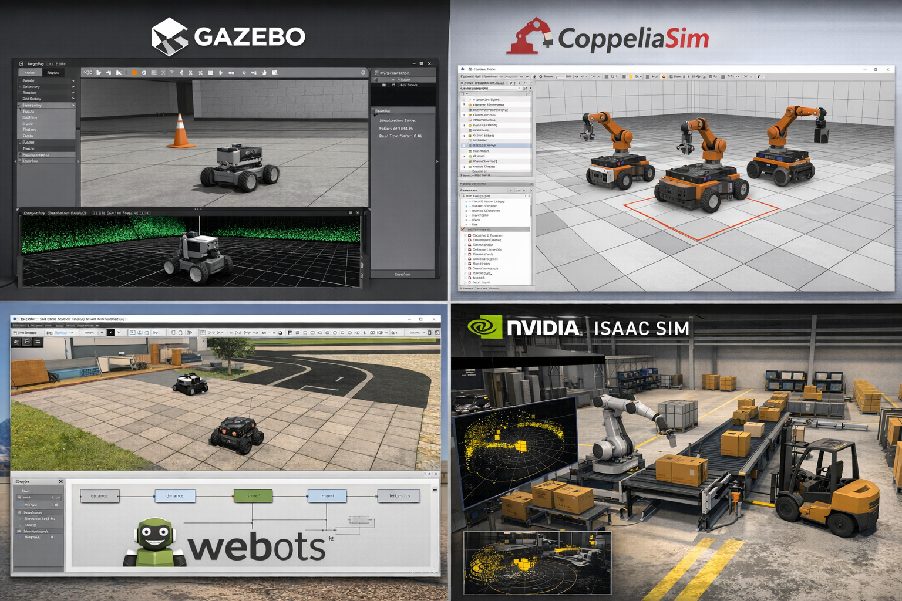

# 02 – SİMÜLASYON VE DİJİTAL İKİZ

Bu bölümde:

* Simülasyon kavramı
* Dijital ikiz (Digital Twin)
* Robotik simülasyon yazılımları
* Gazebo sürüm uyumluluğu
* ROS2 Jazzy için neden Gazebo Harmonic?
* Gazebo kurulumu ve resmi kaynaklar
* Plugin kavramına giriş

anlatılacaktır.

---

# 1️⃣ Simülasyon Nedir?

Simülasyon, gerçek bir fiziksel sistemin davranışını dijital ortamda modelleyerek test etme sürecidir.

Robotik sistemlerde simülasyon:

* Algoritma geliştirme
* Sensör doğrulama
* Navigasyon testleri
* Riskli senaryoların güvenli denenmesi
* Donanım gelmeden yazılım geliştirme

için kullanılır.

Gerçek robot üzerinde test:

* Maliyetlidir
* Risklidir
* Zaman alır

Simülasyon ise:

* Güvenlidir
* Hızlıdır
* Tekrarlanabilirdir
* Ölçeklenebilirdir

---

## Robotik Simülasyon Ortamı Örneği

---

# 2️⃣ Dijital İkiz (Digital Twin) Nedir?

Dijital ikiz, gerçek bir robotun dijital ortamda birebir davranış modelidir.

Bir robotun dijital ikizi şunları içerir:

* Gerçek ölçüler
* Kütle ve atalet değerleri
* Eklem (joint) yapısı
* Sensör yerleşimleri
* Gürültü (noise) modelleri
* Hareket karakteristiği

Amaç:

> Simülasyon ile gerçek robot davranışı arasındaki farkı minimize etmektir.

Eğitim boyunca oluşturacağımız model, Matrobot’un dijital ikizi olacaktır.

---

# 3️⃣ Robotik Simülasyon Yazılımları

Robotik alanında yaygın kullanılan simülasyon ortamları aşağıda özetlenmiştir:

| Simülasyon            | Fizik Doğruluğu | Grafik     | ROS2 Uyumu | Tipik Kullanım       |
| --------------------- | --------------- | ---------- | ---------- | -------------------- |
| **Gazebo**            | Yüksek          | Orta       | Native     | Ar-Ge, akademik      |
| **CoppeliaSim**       | Orta            | Orta       | Var        | Akademik             |
| **Webots**            | Orta            | Orta       | Var        | Eğitim               |
| **MATLAB / Simulink** | Yüksek          | Düşük      | Dolaylı    | Kontrol mühendisliği |
| **NVIDIA Isaac Sim**  | Çok yüksek      | Çok yüksek | Var        | AI & Endüstriyel     |
| **Unity / Unreal**    | Orta            | Çok yüksek | Bridge ile | Görselleştirme       |

Bu eğitim:

* Fizik doğruluğu
* ROS2 entegrasyonu
* Sensör üretimi

öncelikli olduğu için **Gazebo** tercih edilmiştir.

Aşağıdaki görsel; Gazebo, CoppeliaSim, Webots ve NVIDIA Isaac Sim platformlarını tek bir kompozit görüntüde göstermektedir:



---

# 4️⃣ Gazebo Sürüm Uyumluluğu

Resmi Gazebo önerilen binary kurulum tablosu:

| Platform                 | Gazebo Versions                                                                                 |
| ------------------------ | ----------------------------------------------------------------------------------------------- |
| **Ubuntu 24.04 (Noble)** | Gazebo Jetty (recommended), Gazebo Harmonic (ROS2 Jazzy kullanıyorsanız önerilir), Gazebo Ionic |
| **Ubuntu 22.04 (Jammy)** | Gazebo Harmonic (recommended), Gazebo Fortress (ROS2 Humble için önerilir)                      |
| **Mac Ventura**          | Gazebo Harmonic (recommended), Gazebo Fortress                                                  |
| **Mac Monterey**         | Gazebo Harmonic (recommended), Gazebo Fortress                                                  |
| **Windows**              | Conda-Forge desteği mevcut ancak runtime sorunları bulunmaktadır                                |

---

# 5️⃣ Bu Eğitimde Neden Gazebo Harmonic?

Hedef kombinasyonumuz:

* **ROS2 Jazzy**
* **Gazebo Harmonic**
* **Ubuntu 24.04 (tercihen)**

### Neden?

* ROS2 Jazzy ile uyumlu önerilen sürümlerden biridir.
* Sensör simülasyonu için güçlü altyapı sunar.
* Diferansiyel sürüş ve fizik motoru açısından yeterli doğruluğa sahiptir.
* Aktif olarak desteklenen güncel sürümdür.

Bu nedenle eğitim boyunca Gazebo Harmonic kullanılacaktır.

)
---

# 6️⃣ Gazebo Harmonic Kurulumu

Gazebo kurulumu için resmi dokümantasyon takip edilmelidir:

👉 [https://gazebosim.org/docs/latest/install_ubuntu/](https://gazebosim.org/docs/latest/install_ubuntu/)

Kurulum adımları genel olarak:

1. İşletim sistemi sürümünü kontrol edin.
2. Gazebo repository anahtarlarını ekleyin.
3. Apt kaynaklarını güncelleyin.
4. Gazebo Harmonic paketini yükleyin.

Kurulum sonrası test:

```bash
gz sim
```

Komut çalışıyor ve arayüz açılıyorsa kurulum başarılıdır.

---

# 7️⃣ Gazebo Tutorial Kaynağı

Gazebo öğrenmek için resmi tutorial sayfası:

👉 [https://gazebosim.org/docs/harmonic/tutorials/](https://gazebosim.org/docs/harmonic/tutorials/)

Bu sayfada:

* World oluşturma
* Model ekleme
* Sensör tanımlama
* Plugin sistemi
* SDF yapısı

gibi konular detaylı şekilde anlatılmaktadır.

---

# 8️⃣ Gazebo Fuel – Hazır Modeller

Gazebo’nun resmi model deposu:

👉 [https://app.gazebosim.org/fuel/models](https://app.gazebosim.org/fuel/models)

Bu platform üzerinden:

* Hazır robotlar
* Sensör sistemleri
* World dosyaları
* Endüstriyel ortamlar

indirilebilir.

Alternatif olarak:

* Robotlar **URDF** formatında
* Simülasyon tarafı **SDF** formatında

oluşturulabilir.

Bu eğitimde:

* Robot tanımı → URDF/Xacro
* Simülasyon motoru → Gazebo (SDF altyapısı)

kullanılacaktır.

---

# 9️⃣ Plugin Nedir?

Plugin, simülasyon ortamına davranış kazandıran modüldür.

Pluginler sayesinde:

* Robot hareket modeli çalışır
* Sensör verileri üretilir
* Eklem durumları yayınlanır
* Fiziksel davranış modellenir

Matrobot üzerinde kullanılan pluginler ve sensör tanımları, bir sonraki bölümde detaylı olarak incelenecektir.

---

# 🔟 Bu Bölümün Kazanımları

Bu bölüm sonunda katılımcı:

* Simülasyon kavramını bilir
* Dijital ikiz mantığını anlar
* Robotik simülasyon araçlarını tanır
* ROS2 Jazzy için neden Gazebo Harmonic seçildiğini bilir
* Gazebo’yu resmi kaynaktan kurabilir
* Tutorial ve Fuel kaynaklarını kullanabilir
* Plugin kavramını genel çerçevede anlar

---
