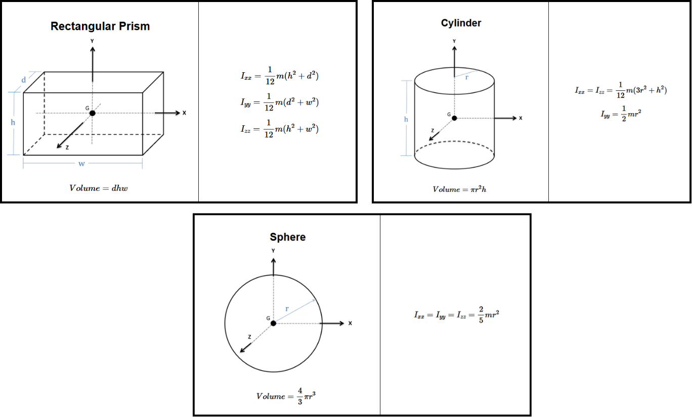
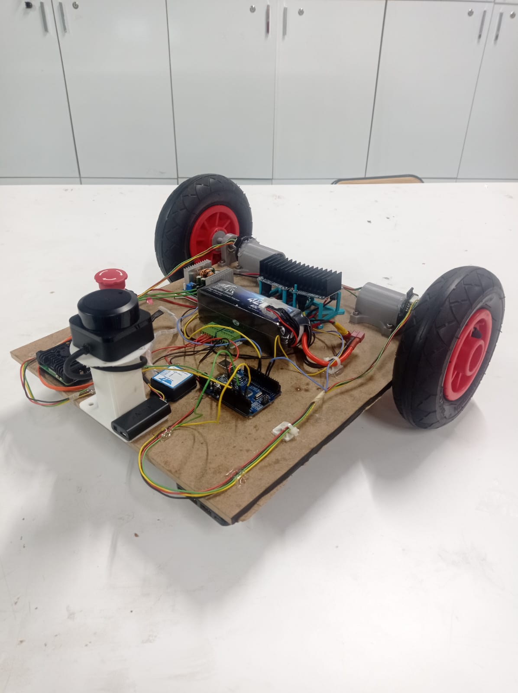

# 03 – URDF - XACRO YAPISI ve MATROBOT MODEL İNCELEMESİ

Bu bölümde önce **genelden özele** bir yaklaşım izlenecektir:

1️⃣ URDF’in genel yapısı ve fiziksel modelleme mantığı
2️⃣ Xacro’nun URDF’i nasıl modüler hâle getirdiği
3️⃣ Link – Joint – Inertia – Collision – Visual – Sensor tag’lerinin anlamı
4️⃣ Gazebo’ya özel `surface`, `friction`, `sensor`, `plugin` yapılandırmaları
5️⃣ Matrobot modelinin teknik analizi

---

# 1️⃣ URDF Nedir? (Genel Yapı)

**URDF (Unified Robot Description Format)**, robotların **fiziksel, kinematik ve dinamik yapısını tanımlayan XML tabanlı bir formattır.**

Bir URDF dosyası temelde iki ana yapıdan oluşur:

* **Link** → Katı parçalar
* **Joint** → Bu parçaları bağlayan hareket yapıları

---

## ✔ Link


Robotun fiziksel (rigid) parçalarıdır.

Her link üç kritik alt bileşen içerir:

### 🔹 `inertial`

* Kütle (mass)
* Kütle merkezi (origin)
* Atalet tensörü (inertia matrix)

### 🔹 `collision`

* Fizik motorunun kullandığı çarpışma hacmi
* Basit geometri önerilir (box, cylinder, sphere)
* Detaylı mesh → simülasyonu yavaşlatır

### 🔹 `visual`

* Kullanıcıya görünen model
* Mesh (.stl/.dae) kullanılabilir
* Render odaklıdır

---

## ✔ Joint


Link’leri birbirine bağlar ve robotun **hareket serbestliklerini (DOF)** belirler.

### Temel Joint Türleri

| Joint Tipi | Açıklama             |
| ---------- | -------------------- |
| fixed      | Hareket yok          |
| continuous | Sonsuz dönüş (teker) |
| revolute   | Sınırlı açısal dönüş |
| prismatic  | Doğrusal hareket     |
| floating   | 6 serbestlik (drone) |
| planar     | 2D hareket           |

Her joint mutlaka şunları içerir:

* `parent`
* `child`
* `origin`
* `axis`

---

# ✔ Inertial (Kütle + Atalet)


Fiziğin en kritik kısmıdır.

Yanlış inertia değerleri:

* Robotun devrilmesine
* Sensör hatalarına
* SLAM kaymasına
* Nav2 kontrol bozulmalarına

sebep olabilir.

**Gerçekçi simülasyon = doğru inertia**

---

# 2️⃣ Xacro Nedir? URDF’i Nasıl Güçlendirir?

Xacro, URDF’i **modüler, parametreli ve hesaplanabilir** hâle getirir.

### Xacro ile:

* Makro tanımlanabilir
* Parametre kullanılabilir
* Matematiksel hesap yapılabilir `${...}`
* Tekrarlayan yapılar sadeleştirilebilir

Büyük robot projelerinde Xacro kullanımı neredeyse zorunludur.

---

# 3️⃣ Gazebo’ya Özel Fizik Yapıları

URDF robotun yapısını tanımlar.
Gazebo ise fiziksel davranışı yönetir.

Bu nedenle `<gazebo>` tag’i altında ek fizik parametreleri gerekir.

---

## ✔ 3.1 Surface → Sürtünme

```xml
<surface>
  <friction>
    <ode>
      <mu>1.5</mu>
      <mu2>1.5</mu2>
    </ode>
  </friction>
</surface>
```

* `mu` → ileri-geri sürtünme
* `mu2` → yan sürtünme

Tekerli robotlarda doğru sürtünme olmazsa:

* Robot kayar
* Frenleme bozulur
* Navigasyon kararsızlaşır

---

## ✔ 3.2 Joint Dynamics

```xml
<dynamics damping="0.1" friction="0.01"/>
```

* `damping` → hareketi yumuşatır
* `friction` → eklem sürtünmesi ekler

Özellikle:

* Teker motorlarında
* Manipülatör eklemlerinde
* Bacaklı robotlarda

kritiktir.

---

## ✔ 3.3 Sensor & Plugin Yapısı

Gazebo’da:

* `<sensor>` → lidar, imu, kamera
* `<plugin>` → diff drive, state publisher, kontrol

Yüksek update rate → daha gerçekçi ama daha fazla CPU.

---

# 🎨 URDF – Gazebo Yapı İlişkisi


Bu yapı:

URDF → Kinematik yapı
Gazebo → Dinamik ve fiziksel davranış

şeklinde birlikte çalışır.

---

# 4️⃣ Matrobot Xacro Dosyasının Teknik Analizi



## 4.1 Dosya Başlığı

```xml
<robot name="matrobot" xmlns:xacro="http://www.ros.org/wiki/xacro">
```

* Xacro dosyasıdır
* Robot adı: `matrobot`

---

## 4.2 Property Tanımları

```xml
<xacro:property name="base_width" value="0.34" />
<xacro:property name="wheel_radius" value="0.09" />
```

Avantajları:

* Merkezi parametre yönetimi
* Hızlı tasarım değişikliği
* Hata azaltma

---

## 4.3 Base Link + Inertia

```xml
<link name="base_link">
```

* Gövde kütlesi
* Atalet tensörü
* Collision → kutu
* Visual → kutu + renk

Gövde genellikle en ağır bileşendir → inertia kritik.

---

## 4.4 Teker Makrosu

```xml
<xacro:macro name="Wheel_Link">
```

Her teker:

* Link
* Collision (cylinder)
* Visual
* Sürtünme
* Continuous joint

sağlar.

Bu yapı:

* Gerçekçi dönüş
* Yanal kayma kontrolü
* Stabil hareket

oluşturur.

---

## 4.5 Caster Wheel

* Motorlu değildir
* Collision → sphere
* Joint → fixed

Ağırlık merkezi desteği sağlar.

---

## 4.6 Lidar Sensörü

```xml
<sensor type="gpu_lidar">
```

* 360° tarama
* 640 örnek
* 40 m menzil

SLAM ve navigasyon doğruluğunu doğrudan etkiler.

---

## 4.7 IMU Sensörü

Ayarlanabilir parametreler:

* bias
* stddev
* correlation time

Gerçek robot davranışını simüle etmek için önemlidir.

---

## 4.8 Diff Drive Plugin

```xml
<plugin filename="gz-sim-diff-drive-system">
```

Bu plugin:

* `/cmd_vel` → teker hızına çevirir
* Odometri üretir
* Wheel separation & radius kullanır

Bu olmadan robot hareket etmez.

---

## 4.9 Joint State Publisher

* RViz için gereklidir
* Navigation stack için gereklidir

---

# 5️⃣ Bu Bölümün Kazanımları

Bu bölümü tamamlayan katılımcı:

✔ URDF/Xacro yapısını genel robotik perspektiften anlar
✔ Inertia’nın önemini kavrar
✔ Collision/Visual farkını bilir
✔ Gazebo fizik parametrelerini yorumlayabilir
✔ Matrobot modelini baştan sona anlayabilir
✔ Kendi robot modelini oluşturabilecek seviyeye gelir

---

# 📚 Kaynak

Daha ayrıntılı bilgi için:

👉 [https://ros-notes.readthedocs.io/en/latest/index.html](https://ros-notes.readthedocs.io/en/latest/index.html)

Bu kaynak, URDF ve ROS modelleme yapıları hakkında kapsamlı teknik açıklamalar içermektedir.
