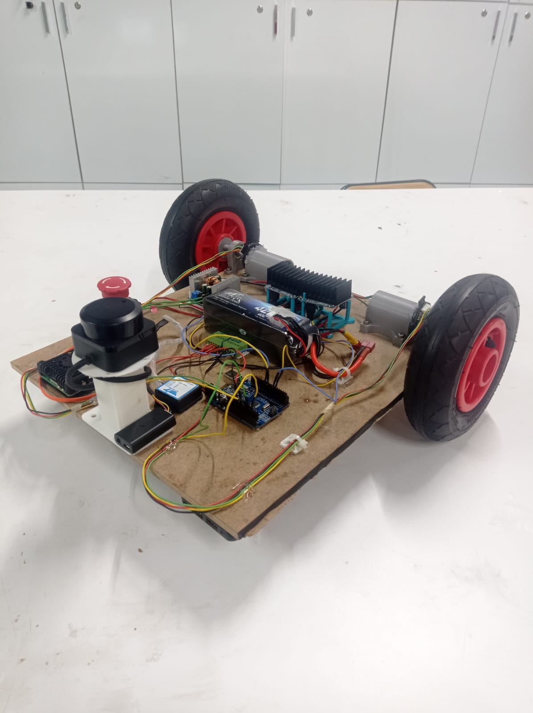

# Matrobot ROS 2



**Matrobot**, Bursa Teknik Üniversitesi **MATRO Topluluğu** tarafından ROS 2 eğitimleri kapsamında geliştirilen iki tekerlekli diferansiyel sürüşlü mobil robot platformudur.

Bu proje kapsamında robot yazılımı **ROS 2 tabanlı** olarak geliştirilmiş ve hem **simülasyon ortamında** hem de **gerçek robot üzerinde** çalışacak şekilde tasarlanmıştır.

Proje içerisinde:

* ROS 2 robot mimarisi
* SLAM (Simultaneous Localization and Mapping)
* Navigasyon
* Sensör entegrasyonu
* Joystick ile robot kontrolü
* Gazebo simülasyonu

uygulamaları gerçekleştirilmiştir.

---

# Sistem Mimarisi

Matrobot yazılımı ROS 2 paketleri üzerine kurulmuştur.

```
matrobot_ros2
│
├── matrobot_bringup
├── matrobot_description
├── matrobot_hardware
├── matrobot_navigation
├── matrobot_simulation
└── matrobot_slam
```

### Paket Açıklamaları

| Paket                    | Açıklama                                           |
| ------------------------ | -------------------------------------------------- |
| **matrobot_bringup**     | Robotun ana başlatma yapıları ve joystick yönetimi |
| **matrobot_description** | Robot URDF / Xacro tanımı                          |
| **matrobot_hardware**    | Gerçek robot donanım arayüzleri                    |
| **matrobot_navigation**  | Navigasyon yapılandırmaları ve haritalar           |
| **matrobot_simulation**  | Gazebo simülasyon ortamı                           |
| **matrobot_slam**        | SLAM ve haritalama launch dosyaları                |

Joystick yönetimi **matrobot_bringup paketi içerisinde** yer almaktadır.

---

# Gereksinimler

* Ubuntu 24.04
* ROS 2 Jazzy
* colcon
* git

ROS 2 kurulumu için:

[https://docs.ros.org/en/jazzy/Installation.html](https://docs.ros.org/en/jazzy/Installation.html)

---

# Kurulum

## Workspace oluşturma

```bash
cd ~
mkdir -p matro_ws/src
cd ~/matro_ws/src
```

---

## Repoyu indirme

```bash
git clone https://github.com/MelikeBeyazli/matrobot_ros2.git
```

---

## Derleme

```bash
cd ~/matro_ws
colcon build
```

---

## ROS ortamını yükleme

```bash
source /opt/ros/jazzy/setup.bash
source ~/matro_ws/install/setup.bash
```

Kalıcı olması için `.bashrc` içine eklenebilir:

```bash
export ROS_DISTRO=jazzy
export ROS_DOMAIN_ID=60

source /opt/ros/$ROS_DISTRO/setup.bash

if [ -f ~/matro_ws/install/setup.bash ]; then
  source ~/matro_ws/install/setup.bash
fi
```

---

# Çalıştırma

Joystick yöneticisini başlatmak için:

```bash
ros2 launch matrobot_bringup joystick_manager.launch.py
```

Bu launch çalıştıktan sonra joystick üzerinden robot sistemi kontrol edilebilir.

---

# Joystick Tuş İşlevleri

Joystick üzerinden farklı ROS launch dosyaları tetiklenebilir.

| Tuş   | İşlev             |
| ----- | ----------------- |
| **A** | Robot bringup     |
| **B** | SLAM başlat       |
| **Y** | Simülasyon başlat |
| **X** | Harita kaydet     |

---

## Bringup

```bash
ros2 launch matrobot_bringup bringup.launch.py ekf_yaml:=ekf_imu_odom
```

---

## SLAM

```bash
ros2 launch matrobot_slam slam_async.launch.py use_rviz:=false
```

---

## Simulation

```bash
ros2 launch matrobot_simulation simulation.launch.py ekf_yaml:=ekf_imu_odom
```

---

## Harita Kaydetme

```bash
ros2 run nav2_map_server map_saver_cli
```

Haritalar şu klasöre kaydedilir:

```
~/matro_ws/src/matrobot_ros2/matrobot_navigation/maps
```

---

# USB Cihazlara Sabit İsim Atama (udev rules)

Linux sistemlerinde USB cihazları yeniden başlatma sonrası farklı port isimleri alabilir:

```
/dev/ttyUSB0
/dev/ttyUSB1
/dev/ttyUSB2
```

Robot sistemlerinde bu durum sensörlerin yanlış portlardan okunmasına neden olabilir.

Bu problemi çözmek için **udev rules kullanılarak sabit port isimleri atanabilir.**

---

# Udev Kural Dosyası Oluşturma

```bash
sudo nano /etc/udev/rules.d/99-matrobot.rules
```

---

# Udev Kuralları

```bash
# Arduino (CH341 UART)
SUBSYSTEM=="tty", ATTRS{idVendor}=="1a86", ATTRS{idProduct}=="7523", SYMLINK+="ttyARDUINO"

# WITMOTION IMU
SUBSYSTEM=="tty", ATTRS{idVendor}=="1a86", ATTRS{idProduct}=="7523", SYMLINK+="ttyIMU"

# RPLIDAR A1
SUBSYSTEM=="tty", ATTRS{idVendor}=="10c4", ATTRS{idProduct}=="ea60", SYMLINK+="ttyLIDAR"
```

---

# Kuralları Etkinleştirme

```bash
sudo udevadm control --reload-rules
sudo udevadm trigger
```

---

# Doğrulama

```bash
ls -l /dev/tty*
```

Örnek çıktı:

```
/dev/ttyIMU -> ttyUSB0
/dev/ttyLIDAR -> ttyUSB1
/dev/ttyARDUINO -> ttyUSB2
```

---

# USB Cihaz Bilgilerini Öğrenme

Bir cihazın **Vendor ID**, **Product ID** ve **Product Name** bilgilerini öğrenmek için aşağıdaki komutlar kullanılabilir.

### dmesg

```bash
dmesg | grep tty
```

---

### udevadm

```bash
udevadm info -a -n /dev/ttyUSB0
```

Burada şu alanlar görülebilir:

```
ATTRS{idVendor}
ATTRS{idProduct}
ATTRS{product}
```

Bu bilgiler udev kuralı yazarken kullanılır.

---

### lsusb

```bash
lsusb
```

Örnek çıktı:

```
Bus 001 Device 004: ID 10c4:ea60 Silicon Labs CP210x UART Bridge
```

---

# Node Kontrolü

Çalışan ROS node’larını görmek için:

```bash
ros2 node list
```
---

# Lisans

Bu proje **ROS 2 eğitimleri kapsamında geliştirilmiştir.**

