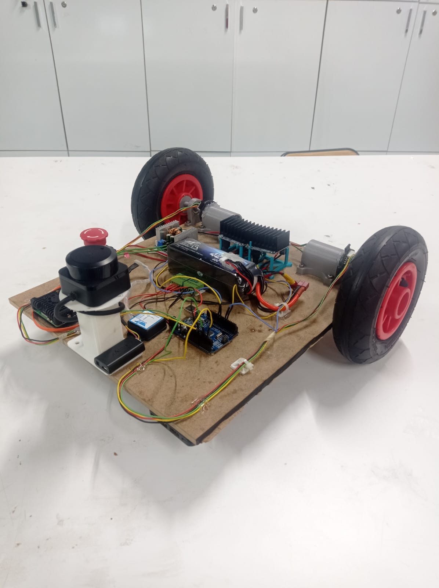
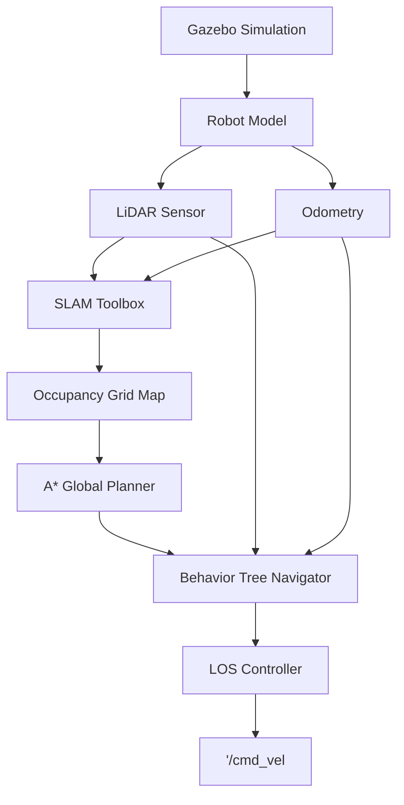
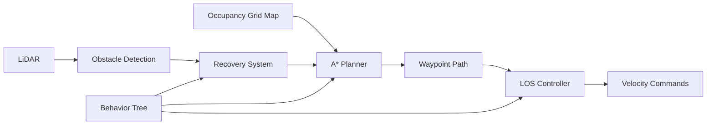
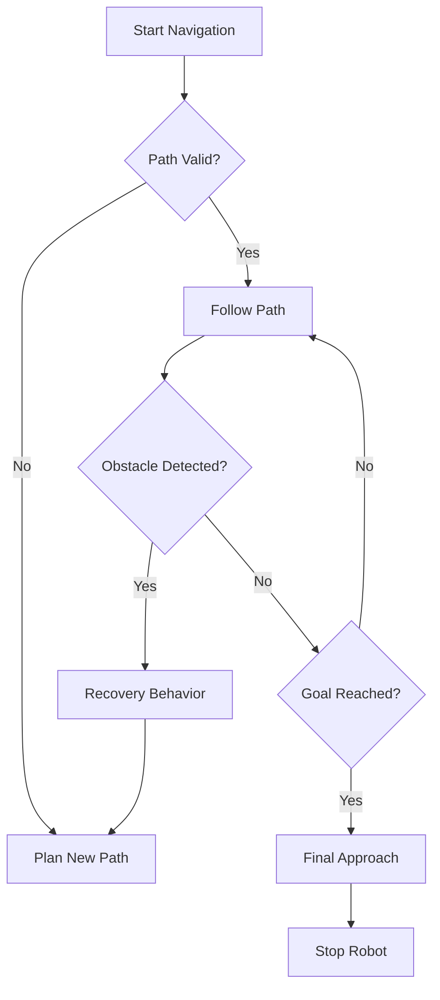

# Matrobot ROS 2

<pd>
  
</pd>

## Genel Bakış

**Matrobot**, Bursa Teknik Üniversitesi MATRO Topluluğu tarafından geliştirilen ROS 2 tabanlı diferansiyel sürüşlü mobil robot platformudur.

Proje hem:

* Gazebo simülasyon ortamında
* hem de gerçek robot üzerinde

çalışacak şekilde tasarlanmıştır.

Bu repo içerisinde özellikle:

* robot modelleme
* simülasyon
* haritalama
* navigasyon
* obstacle avoidance
* Behavior Tree tabanlı karar mekanizması
* LiDAR tabanlı çevre algılama

çalışmaları bulunmaktadır.

---

# Proje Yapısı

Bu repoda aktif olarak kullanılan temel paketler:

```text
matrobot_ros2
│
├── matrobot_description
└── matrobot_simulation
```

---

# Paket Açıklamaları

| Paket                  | Açıklama                                                           |
| ---------------------- | ------------------------------------------------------------------ |
| `matrobot_description` | Robot URDF/Xacro modeli, RViz yapılandırmaları ve sensör tanımları |
| `matrobot_simulation`  | Gazebo ortamı, SLAM, navigasyon, Behavior Tree ve analiz araçları  |

---

# Sistem Mimarisi


```mermaid
graph TD

A[Gazebo Simulation] --> B[Robot Model]
B --> C[LiDAR Sensor]
B --> D[Odometry]

C --> E[SLAM Toolbox]
D --> E

E --> F[Occupancy Grid Map]

F --> G[A* Global Planner]
G --> H[Behavior Tree Navigator]
H --> I[LOS Controller]
I --> J['/cmd_vel]

C --> H
D --> H
```

---

# Kullanılan Teknolojiler

| Teknoloji     | Açıklama                      |
| ------------- | ----------------------------- |
| ROS 2 Humble  | Robot middleware altyapısı    |
| Gazebo        | Simülasyon ortamı             |
| RViz2         | Görselleştirme                |
| SLAM Toolbox  | Haritalama ve lokalizasyon    |
| Python        | Navigasyon ve analiz araçları |
| A* Planner    | Global path planning          |
| Behavior Tree | Karar mekanizması             |

---

# Kurulum

## Workspace Oluşturma

```bash
cd ~
mkdir -p matrobot_ws/src
cd ~/matrobot_ws/src
```

---

## Repoyu Klonlama

```bash
git clone https://github.com/MelikeBeyazli/matrobot_ros2.git
```

---

## Derleme

```bash
cd ~/matrobot_ws
colcon build
```

---

## ROS Ortamını Yükleme

```bash
source /opt/ros/humble/setup.bash
source ~/matrobot_ws/install/setup.bash
```

Kalıcı olması için `.bashrc` içerisine eklenebilir:

```bash
source /opt/ros/humble/setup.bash

if [ -f ~/matrobot_ws/install/setup.bash ]; then
  source ~/matrobot_ws/install/setup.bash
fi
```

---

# Simülasyon

## Gazebo Ortamını Başlatma

```bash
ros2 launch matrobot_simulation simulation.launch.py
```

---

## RViz Başlatma

```bash
rviz2
```

---

# SLAM ve Haritalama

## SLAM Başlatma

```bash
ros2 launch slam_toolbox online_async_launch.py \
  params_file:=~/matrobot_ws/src/matrobot_ros2/matrobot_simulation/config/slam_params.yaml
```

---

## Harita Kaydetme

```bash
ros2 run nav2_map_server map_saver_cli \
  -f ~/matrobot_ws/src/matrobot_ros2/matrobot_simulation/map/default_map
```

Harita çıktıları:

```text
map/
├── default_map.pgm
└── default_map.yaml
```

---

# Navigasyon Sistemi

Navigasyon sistemi şu bileşenlerden oluşmaktadır:


```mermaid
graph LR

A[Occupancy Grid Map] --> B[A* Planner]
B --> C[Waypoint Path]
C --> D[LOS Controller]
D --> E[Velocity Commands]

F[LiDAR] --> G[Obstacle Detection]
G --> H[Recovery System]
H --> B

I[Behavior Tree] --> B
I --> D
I --> H
```

---

# Behavior Tree Yapısı

Navigasyon sistemi klasik FSM yerine BT (Behavior Tree) mantığı kullanılarak geliştirilmiştir.

Kullanılan temel BT node'ları:

| Node          | Görev                            |
| ------------- | -------------------------------- |
| EnsurePath    | Yol kontrolü                     |
| ReplanPath    | Yeniden yol planlama             |
| FollowPathLOS | LOS tabanlı yol takibi           |
| Recovery      | Engel sonrası kurtarma davranışı |
| FinalApproach | Hedefe son yaklaşım              |

---

## BT Akışı


```mermaid
graph TD

A[Start Navigation]
--> B{Path Valid?}

B -- No --> C[Plan New Path]
B -- Yes --> D[Follow Path]

D --> E{Obstacle Detected?}

E -- Yes --> F[Recovery Behavior]
E -- No --> G{Goal Reached?}

F --> C

G -- No --> D
G -- Yes --> H[Final Approach]
H --> I[Stop Robot]
```

---

# Obstacle Avoidance

Sistem LiDAR verisini kullanarak:

* ön engel algılama
* hız düşürme
* acil durma
* geri gitme
* yeniden planlama

işlemlerini gerçekleştirmektedir.

Kullanılan temel parametreler:

| Parametre           | Açıklama                    |
| ------------------- | --------------------------- |
| `slow_distance`     | Hız düşürme mesafesi        |
| `stop_distance`     | Tam durma mesafesi          |
| `critical_distance` | Recovery tetikleme mesafesi |
| `robot_radius_m`    | Robot yarıçapı              |
| `safety_margin_m`   | Güvenlik payı               |

---

# Frontier Exploration

Sistem ayrıca frontier tabanlı exploration desteği içermektedir.

Amaç:

* bilinmeyen alanları keşfetmek
* otomatik harita oluşturmak
* coverage mantığı ile alan taramak

---

# Kullanılan Topicler

| Topic           | Açıklama           |
| --------------- | ------------------ |
| `/scan`         | LiDAR verisi       |
| `/map`          | Occupancy grid map |
| `/cmd_vel`      | Robot hız komutu   |
| `/planned_path` | Planlanan yol      |
| `/odom`         | Odometri           |

---

# Klasör Yapısı

```text
matrobot_simulation
│
├── config
├── launch
├── map
├── plots
├── scripts
│   ├── navigation
│   ├── exploration
│   └── analysis
├── worlds
└── rviz
```

---

# Analiz ve Grafikler

Navigasyon sonuçları otomatik olarak CSV formatında kaydedilmektedir.

Üretilen analizler:

* robot trajectory
* goal convergence
* obstacle proximity
* BT state timeline
* recovery behavior timeline
* localization error analysis

Grafik üretimi:

```bash
python3 scripts/analysis/academic_plot_suite.py
```

---

# Örnek Çalıştırma

## Simülasyon Başlat

```bash
ros2 launch matrobot_simulation simulation.launch.py
```

---

## Harita Yükleme

```bash
ros2 run nav2_map_server map_server \
  --ros-args \
  -p yaml_filename:=~/matrobot_ws/src/matrobot_ros2/matrobot_simulation/map/default_map.yaml
```

---

## Navigation Başlat

```bash
python3 scripts/navigation/bt_navigator_node.py \
  --ros-args \
  --params-file config/matrobot_navigation_params.yaml
```

---

# Geliştirme Notları

Sistem halen aktif geliştirme aşamasındadır.

Planlanan geliştirmeler:

* Nav2 entegrasyonu
* DWA local planner
* MPC controller
* gerçek robot testleri
* semantic mapping
* gelişmiş frontier exploration

---

# Lisans

Bu proje eğitim ve araştırma amaçlı geliştirilmiştir.
